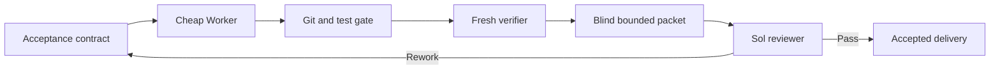

<div align="center">
  <picture>
    <source media="(prefers-color-scheme: dark)" srcset=".github/logo-dark.svg">
    <source media="(prefers-color-scheme: light)" srcset=".github/logo-light.svg">
    
  </picture>

  <p><strong>English</strong> | <a href="README.zh-CN.md">中文</a></p>

  <p><strong>70.79% fewer expensive-model tokens across 12 paired tasks—with no observed delivery-quality loss.</strong></p>
  <p><sub>The collaboration route passed the preregistered 5-point non-inferiority gate: 91.67% vs 83.33% task success.</sub></p>
</div>

<div align="center">

[![License: MIT][license-shield]][license-url]
[![Release][release-shield]][release-url]
[![Tests][tests-shield]][tests-url]
[![Agent Skills][skills-shield]][skills-url]
[![Python][python-shield]][python-url]

</div>

<div align="center">
  <a href="#why-token-firewall">Why</a> &middot;
  <a href="#experimental-evidence">Evidence</a> &middot;
  <a href="#evaluation-framework">Framework</a> &middot;
  <a href="#quick-start">Quick Start</a> &middot;
  <a href="#install">Install</a> &middot;
  <a href="docs/architecture.md">Architecture</a>
</div>

<br>

[Agent Skills](https://agentskills.io) compatible. The bundled Runtime uses only the Python standard library; Codex CLI, Claude Code, and MiniMax Code are optional execution transports.

> **Expanded-study result:** across 12 paired low/medium/high-risk tasks, the Terra-worker/Sol-reviewer route reduced cumulative expensive Sol tokens from **3,599,108** to **1,051,353** (**70.79%**) while achieving **91.67%** task success versus **83.33%** for Sol-direct. The preregistered paired non-inferiority gate passed.
>
> **What this means:** this study found no delivery-quality loss under its frozen protocol; it does not prove universal equivalence for every repository, model release, or task distribution.

---

## Why Token Firewall

Powerful coding models are often billed for every token spent exploring files, running tests, and implementing routine changes. If your expensive model is doing all of that work itself, most of the budget goes to execution rather than judgment.

Token Firewall turns the expensive model into a bounded chief reviewer. It decomposes the task into explicit contracts, delegates implementation to a cheaper Worker, rebuilds evidence from Git and approved tests, and escalates only a compact anonymous review packet.

## What You Get

- **Reserve expensive tokens for decisions.** Sol/GPT-5.6 reviews a compact evidence packet instead of implementing from the full conversation.
- **Make cheaper Workers safer.** Every Work Order carries positive cases, negative cases, and a concrete semantic boundary.
- **Trust Git and tests, not model claims.** The Broker independently checks scope, reconstructs the patch, and reruns approved validators.
- **Choose the M3 transport you actually have.** Run MiniMax M3 through MiniMax Code or through Claude Code with verified effective-model identity; neither Harness is an installation dependency.
- **See external work without terminal noise.** Append-only events, low-frequency state cards, Session IDs, usage, and delivery hashes remain available for audit.
- **Measure quality and savings together.** Frozen paired experiments keep failed attempts, rework, hidden tests, native usage, and expensive-reviewer tokens in one Evaluation Lab.
- **Fail closed.** Unknown model identity, unsafe isolation, dirty source state, incomplete usage, mismatched commits, or corrupted archives stop the route instead of weakening it.

## Experimental Evidence

The primary Terra study contains 12 paired tasks spanning feature, bug-fix, refactor, and integration work across all three risk tiers. Each arm started from the same frozen commit and acceptance contract. A task counted as successful only after the public gate, deferred hidden tests, anonymous bounded review, scope checks, and complete usage evidence all passed.

<div align="center">
  
</div>

The two zero-based panels share the same task order but use separate axes. They show the intended claim—delivery quality remained non-inferior while expensive-model Token use fell—without implying that Token consumption caused the observed quality differences.

| Study / route | Paired tasks | Success vs Sol-direct | Mean quality | Control Sol tokens | Route Sol tokens | Sol reduction | Verdict |
|---|---:|---|---:|---:|---:|---:|---|
| **Terra expanded study** | **12** | **83.33% → 91.67%** | **94.58 → 96.67** | **3,599,108** | **1,051,353** | **70.79%** | **`PASS`** |
| M3 directional pilot | 2 | 100% → 100% | 100 → 100 | 598,925 | 242,649 | 59.49% | `INSUFFICIENT_SAMPLE` |
| Claude Sonnet directional pilot | 2 | 100% → 0% | 100 → 7.5 | 598,925 | 0 | Not interpretable | `INSUFFICIENT_SAMPLE` |

For the expanded Terra study, the paired success-rate difference was **+8.33 percentage points** with a paired 95% Bootstrap interval of **[0, 25]** points. Its lower bound is above the frozen −5-point margin, there were no critical regressions, usage was complete, and the sample/coverage threshold was met. Therefore the protocol reports `PASS`: **Token use fell substantially without an observed delivery-quality loss in this study.**

One candidate dataset task was excluded only after both arms completed because its hidden assertion contradicted the frozen Acceptance Spec; the record and replacement decision remain disclosed in the experiment schedule. A valid semantic failure and a Harness recovery attempt remain included. M3 and Claude results are still two-task directional pilots and must not be merged into the 12-task Terra conclusion.

- [Methodology, limitations, and reproduction](docs/evaluation.md)
- [Frozen 12-pair Terra Lab](evidence/labs/terra-route-n12-001/report/evaluation-report.md) · [Reproducible task suite](experiments/terra-route-n12-001/) · [M3 Pilot](evidence/labs/m3-route-model-only-001/report/evaluation-report.md) · [Claude Pilot](evidence/labs/claude-route-model-only-001/report/evaluation-report.md)

## Quick Start

```text
"Use token-firewall-team to implement this issue" — bounded delegation, Git/test gates, and a compact final review
"Benchmark this route against Sol-direct"       — frozen paired records, Token accounting, and evaluation charts
"Show the external Worker status"               — low-noise state, heartbeat, Session, usage, and delivery summary
```

## Install

```bash
npx skills add WdBlink/token-firewall-team -g
```

The Skill itself has no third-party Python dependency. You need Codex plus at least one usable execution route:

| Capability | Requirement | Required? |
|---|---|---:|
| Terra/Sol routes | Codex CLI with the selected model available | Optional |
| M3 through Claude Code | Claude Code; returned `modelUsage` must verify MiniMax M3 | Optional |
| M3 through MiniMax Code | MiniMax Code/Mavis CLI with a safe production preflight | Optional |
| Protocol validation and Evaluation Lab | Python 3.10+ | Yes |

Missing MiniMax Code disables only the native MiniMax route. Missing Claude Code disables only the Claude transport. Token Firewall never silently switches Harness inside an active Run.

## Usage

Ask Codex to use the Skill for a coding task:

```text
Use token-firewall-team for this change. Keep Sol as the final reviewer,
route implementation to an approved cheaper Worker, and show only
state changes and low-frequency heartbeats.
```

Or invoke the bundled Runtime directly:

```bash
TF="python3 skills/token-firewall-team/scripts/token_firewall.py"

# Check only the route you intend to use; preflight spends no model tokens.
$TF runtime-preflight --runtime codex
$TF runtime-preflight --runtime claude
$TF runtime-preflight --runtime minimax --agent coder

# Validate immutable contracts before dispatch.
$TF validate mission-contract.json
$TF validate work-order.json
```

A real Run additionally needs a clean Git repository, a full base Commit ID, a Run directory outside the source repository, and an explicit Worker route. See the [Runtime runbook](skills/token-firewall-team/references/runbook.md) for complete commands.

## How It Works



The authority chain is immutable contract → deterministic Broker/Git gates → fresh Verifier → Sol chief reviewer. Worker output is always a proposal.

→ [Architecture and transport boundaries](docs/architecture.md)

## Evaluation Framework

The implemented framework is the layered option discussed during design:

1. **Token Firewall Benchmark Runtime is the source of truth.** It freezes Git state, acceptance contracts, public and hidden tests, blind review, model/session identity, retries, rework, and native usage.
2. **Immutable Evaluation Pairs + Evaluation Lab make the release decision.** They deduplicate cumulative expensive-model Tokens by Session ID, run paired Bootstrap non-inferiority analysis, enforce the 12-pair/risk/task-type gates, and render deterministic charts.
3. **Inspect AI is an optional analysis compatibility layer.** `evaluation-export-inspect` emits a hashed JSONL dataset; the included adapter provides custom multi-value scoring, risk/task-type groups, Task-ID-clustered standard errors, structured `.eval` logs, and offline re-scoring without another model call.

Inspect does not replace the protocol kernel because it is not the authority for external Coding CLI delivery, Git provenance, or cumulative Session-deduplicated cost. SWE-bench can add external comparability, while an LLM judge remains one semantic gate—not the sole quality measure.

→ [Framework selection, decision rule, and Inspect integration](docs/evaluation-framework.md)

## When to Use It

Use Token Firewall when implementation context is large, an expensive model is available for final judgment, and the task can be expressed through deterministic acceptance evidence.

Do not use it to justify weak acceptance criteria, to automate irreversible production actions without approval, or to turn one synthetic study into a universal quality guarantee. Critical migrations, destructive operations, and irreducibly ambiguous work should remain with the strongest approved implementer and explicit human boundaries.

## Current Limits

- The primary study meets the frozen 12-pair threshold, but it is still one synthetic Python task suite and one Terra/Sol model configuration; external-repository replication remains necessary.
- The M3 and Claude route comparisons remain directional (`n=2` each).
- Native MiniMax Code availability and permission behavior may change between app releases; the Adapter therefore fails closed.
- Claude Code provides structured delivery and verified model identity, but fine-grained mid-turn progress is still coarser than its final Stage evidence.
- The Claude outer OS write sandbox is currently implemented on macOS; other platforms must supply an equivalent verified boundary before production use.
- Sol remains the final decision-maker for accepted delivery; hidden tests alone are not treated as semantic review.

## What's Inside

```text
skills/token-firewall-team/  Complete installable Skill bundle
  SKILL.md                 Agent workflow and routing rules
  references/              Protocol, Runtime runbook, and calibrated evidence
  scripts/token_firewall.py  Zero-dependency CLI entry point
  scripts/token_firewall_runtime/  Bundled Python Runtime and JSON Schemas
tests/token_firewall/     96 protocol, Runtime, fault, archive, and evaluation tests
evidence/labs/            Frozen pair records, hashes, reports, and deterministic charts
experiments/              Reproducible task fixtures, contracts, hidden suites, and schedules
integrations/inspect_ai/  Optional Inspect AI analysis adapter
docs/                     Human-facing architecture and evaluation notes
```

## Contributing

Contributions are welcome. Preserve the fail-closed authority chain, include tests for protocol changes, and keep model transcripts or credentials out of the repository. See [CONTRIBUTING.md](CONTRIBUTING.md).

## License

[MIT](LICENSE) © 2026 WdBlink.

---

Forged with [Skill Forge](https://github.com/motiful/skill-forge) · Crafted with [Readme Craft](https://github.com/motiful/readme-craft)

[license-shield]: https://img.shields.io/github/license/WdBlink/token-firewall-team.svg?style=flat-square
[license-url]: LICENSE
[release-shield]: https://img.shields.io/github/v/release/WdBlink/token-firewall-team?style=flat-square
[release-url]: https://github.com/WdBlink/token-firewall-team/releases
[tests-shield]: https://img.shields.io/github/actions/workflow/status/WdBlink/token-firewall-team/tests.yml?branch=main&style=flat-square&label=tests
[tests-url]: https://github.com/WdBlink/token-firewall-team/actions/workflows/tests.yml
[skills-shield]: https://img.shields.io/badge/Agent%20Skills-compatible-7F56D9?style=flat-square
[skills-url]: https://agentskills.io
[python-shield]: https://img.shields.io/badge/Python-3.10%2B-3776AB?style=flat-square&logo=python&logoColor=white
[python-url]: https://www.python.org/
