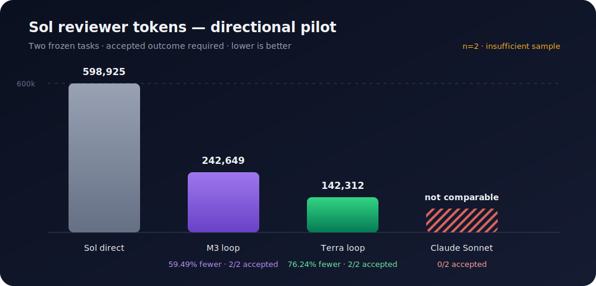
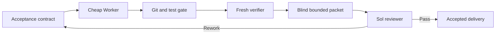

<div align="center">
  <picture>
    <source media="(prefers-color-scheme: dark)" srcset=".github/logo-dark.svg">
    <source media="(prefers-color-scheme: light)" srcset=".github/logo-light.svg">
    
  </picture>

  <p><strong>Spend frontier-model tokens on judgment, not implementation.</strong></p>
</div>

<div align="center">

[![License: MIT][license-shield]][license-url]
[![Release][release-shield]][release-url]
[![Tests][tests-shield]][tests-url]
[![Agent Skills][skills-shield]][skills-url]
[![Python][python-shield]][python-url]

</div>

<div align="center">
  <a href="#why-token-firewall">Why</a> &middot;
  <a href="#experimental-evidence">Evidence</a> &middot;
  <a href="#quick-start">Quick Start</a> &middot;
  <a href="#install">Install</a> &middot;
  <a href="docs/architecture.md">Architecture</a>
</div>

<br>

[Agent Skills](https://agentskills.io) compatible. The bundled Runtime uses only the Python standard library; Codex CLI, Claude Code, and MiniMax Code are optional execution transports.

---

## Why Token Firewall

Powerful coding models are often billed for every token spent exploring files, running tests, and implementing routine changes. If your expensive model is doing all of that work itself, most of the budget goes to execution rather than judgment.

Token Firewall turns the expensive model into a bounded chief reviewer. It decomposes the task into explicit contracts, delegates implementation to a cheaper Worker, rebuilds evidence from Git and approved tests, and escalates only a compact anonymous review packet.

## What You Get

- **Reserve expensive tokens for decisions.** Sol/GPT-5.6 reviews a compact evidence packet instead of implementing from the full conversation.
- **Make cheaper Workers safer.** Every Work Order carries positive cases, negative cases, and a concrete semantic boundary.
- **Trust Git and tests, not model claims.** The Broker independently checks scope, reconstructs the patch, and reruns approved validators.
- **Choose the M3 transport you actually have.** Run MiniMax M3 through MiniMax Code or through Claude Code with verified effective-model identity; neither Harness is an installation dependency.
- **See external work without terminal noise.** Append-only events, low-frequency state cards, Session IDs, usage, and delivery hashes remain available for audit.
- **Measure quality and savings together.** Frozen paired experiments keep failed attempts, rework, hidden tests, native usage, and expensive-reviewer tokens in one Evaluation Lab.
- **Fail closed.** Unknown model identity, unsafe isolation, dirty source state, incomplete usage, mismatched commits, or corrupted archives stop the route instead of weakening it.

## Experimental Evidence

> **Directional Pilot — not a general non-inferiority claim.** The current frozen dataset contains only two paired bug-fix tasks (`n=2`): one low-risk semantic-boundary task and one high-risk authentication task. Every route remains `INSUFFICIENT_SAMPLE` under the release protocol.

<div align="center">
  
</div>

| Route | Accepted tasks | Control Sol tokens | Route Sol tokens | Sol reduction | Frozen verdict |
|---|---:|---:|---:|---:|---|
| M3 loop | 2/2 | 598,925 | 242,649 | 59.49% | `INSUFFICIENT_SAMPLE` |
| Terra loop | 2/2 | 598,925 | 142,312 | 76.24% | `INSUFFICIENT_SAMPLE` |
| Claude Sonnet loop | 0/2 | 598,925 | 0 | Not interpretable | `INSUFFICIENT_SAMPLE` |

The M3 and Terra routes retained accepted outcomes on both Pilot tasks while using fewer Sol tokens. Claude Sonnet consumed no Sol review tokens because neither candidate reached final review; that is a quality failure, not a 100% saving.

The experiment froze base commits, public validators, deferred hidden tests, blind Sol review, Session-level usage accounting, and all failures/retries. The protocol requires at least 12 task pairs plus broader task coverage before a release decision.

- [Methodology, limitations, and reproduction](docs/evaluation.md)
- [Frozen M3 Lab](evidence/labs/m3-route-model-only-001/report/evaluation-report.md) · [Terra Lab](evidence/labs/terra-route-model-only-001/report/evaluation-report.md) · [Claude Lab](evidence/labs/claude-route-model-only-001/report/evaluation-report.md)

## Quick Start

```text
"Use token-firewall-team to implement this issue" — bounded delegation, Git/test gates, and a compact final review
"Benchmark this route against Sol-direct"       — frozen paired records, Token accounting, and evaluation charts
"Show the external Worker status"               — low-noise state, heartbeat, Session, usage, and delivery summary
```

## Install

```bash
npx skills add WdBlink/token-firewall-team -g
```

The Skill itself has no third-party Python dependency. You need Codex plus at least one usable execution route:

| Capability | Requirement | Required? |
|---|---|---:|
| Terra/Sol routes | Codex CLI with the selected model available | Optional |
| M3 through Claude Code | Claude Code; returned `modelUsage` must verify MiniMax M3 | Optional |
| M3 through MiniMax Code | MiniMax Code/Mavis CLI with a safe production preflight | Optional |
| Protocol validation and Evaluation Lab | Python 3.10+ | Yes |

Missing MiniMax Code disables only the native MiniMax route. Missing Claude Code disables only the Claude transport. Token Firewall never silently switches Harness inside an active Run.

## Usage

Ask Codex to use the Skill for a coding task:

```text
Use token-firewall-team for this change. Keep Sol as the final reviewer,
route implementation to an approved cheaper Worker, and show only
state changes and low-frequency heartbeats.
```

Or invoke the bundled Runtime directly:

```bash
TF="python3 scripts/token_firewall.py"

# Check only the route you intend to use; preflight spends no model tokens.
$TF runtime-preflight --runtime codex
$TF runtime-preflight --runtime claude
$TF runtime-preflight --runtime minimax --agent coder

# Validate immutable contracts before dispatch.
$TF validate mission-contract.json
$TF validate work-order.json
```

A real Run additionally needs a clean Git repository, a full base Commit ID, a Run directory outside the source repository, and an explicit Worker route. See the [Runtime runbook](references/runbook.md) for complete commands.

## How It Works



The authority chain is immutable contract → deterministic Broker/Git gates → fresh Verifier → Sol chief reviewer. Worker output is always a proposal.

→ [Architecture and transport boundaries](docs/architecture.md)

## When to Use It

Use Token Firewall when implementation context is large, an expensive model is available for final judgment, and the task can be expressed through deterministic acceptance evidence.

Do not use it to justify weak acceptance criteria, to automate irreversible production actions without approval, or to claim universal quality from the included two-task Pilot. Critical migrations, destructive operations, and irreducibly ambiguous work should remain with the strongest approved implementer and explicit human boundaries.

## Current Limits

- The included experiment is directional (`n=2`), below the frozen 12-pair release threshold.
- Native MiniMax Code availability and permission behavior may change between app releases; the Adapter therefore fails closed.
- Claude Code provides structured delivery and verified model identity, but fine-grained mid-turn progress is still coarser than its final Stage evidence.
- The Claude outer OS write sandbox is currently implemented on macOS; other platforms must supply an equivalent verified boundary before production use.
- Sol remains the final decision-maker for accepted delivery; hidden tests alone are not treated as semantic review.

## What's Inside

```text
SKILL.md                 Agent workflow and routing rules
references/              Protocol, Runtime runbook, and calibrated evidence
scripts/token_firewall.py  Zero-dependency CLI entry point
scripts/token_firewall_runtime/  Bundled Python Runtime and JSON Schemas
tests/token_firewall/     92 protocol, Runtime, fault, archive, and evaluation tests
evidence/labs/            Frozen pair records, hashes, reports, and deterministic charts
docs/                     Human-facing architecture and evaluation notes
```

## Contributing

Contributions are welcome. Preserve the fail-closed authority chain, include tests for protocol changes, and keep model transcripts or credentials out of the repository. See [CONTRIBUTING.md](CONTRIBUTING.md).

## License

[MIT](LICENSE) © 2026 WdBlink.

---

Forged with [Skill Forge](https://github.com/motiful/skill-forge) · Crafted with [Readme Craft](https://github.com/motiful/readme-craft)

[license-shield]: https://img.shields.io/github/license/WdBlink/token-firewall-team.svg?style=flat-square
[license-url]: LICENSE
[release-shield]: https://img.shields.io/github/v/release/WdBlink/token-firewall-team?style=flat-square
[release-url]: https://github.com/WdBlink/token-firewall-team/releases
[tests-shield]: https://img.shields.io/github/actions/workflow/status/WdBlink/token-firewall-team/tests.yml?branch=main&style=flat-square&label=tests
[tests-url]: https://github.com/WdBlink/token-firewall-team/actions/workflows/tests.yml
[skills-shield]: https://img.shields.io/badge/Agent%20Skills-compatible-7F56D9?style=flat-square
[skills-url]: https://agentskills.io
[python-shield]: https://img.shields.io/badge/Python-3.10%2B-3776AB?style=flat-square&logo=python&logoColor=white
[python-url]: https://www.python.org/
