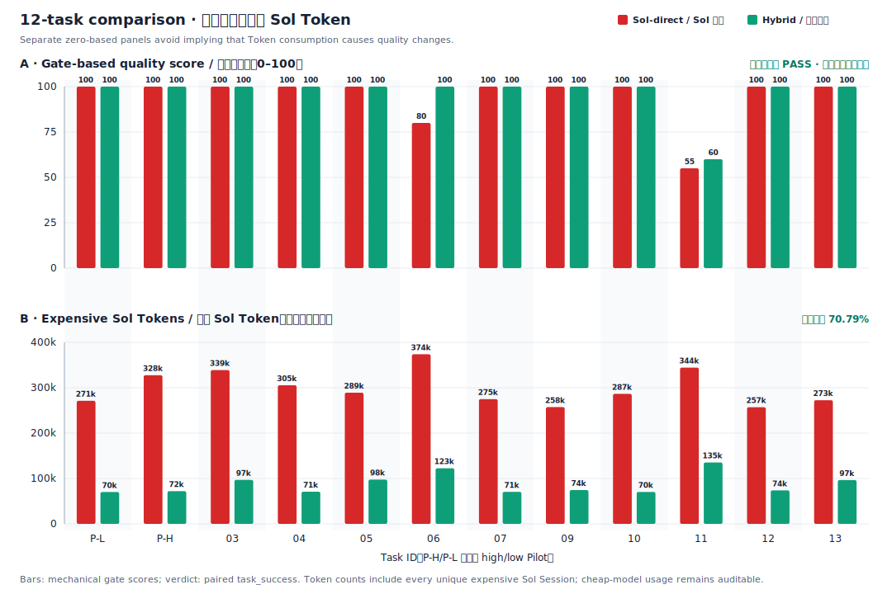

<div align="center">
  <picture>
    <source media="(prefers-color-scheme: dark)" srcset=".github/logo-dark.svg">
    <source media="(prefers-color-scheme: light)" srcset=".github/logo-light.svg">
    
  </picture>

  <p><strong>70.79% fewer expensive coding-model tokens in a 12-task study—without giving up quality control.</strong></p>
  <p>Codex routes native Agents by task—including an optional MiniMax-M3 economy Worker. Stronger reasoning reviews a compact, Git-and-test-backed delivery.</p>
  <p><strong>English</strong> | <a href="README.zh-CN.md">中文</a></p>
</div>

<div align="center">

[![License: MIT][license-shield]][license-url]
[![Release][release-shield]][release-url]
[![Tests][tests-shield]][tests-url]
[![Agent Skills][skills-shield]][skills-url]
[![Python][python-shield]][python-url]

</div>

<div align="center">
  <a href="#quick-start">Quick Start</a> &middot;
  <a href="#why-token-firewall">Why</a> &middot;
  <a href="#experimental-evidence">Evidence</a> &middot;
  <a href="#how-it-works">How It Works</a> &middot;
  <a href="#current-limits">Limits</a> &middot;
  <a href="docs/evaluation.md">Study Details</a>
</div>

> **Primary-study result:** In a frozen 12-task Terra-worker/Sol-reviewer study, expensive Sol tokens fell **70.79%**—from **3,599,108** to **1,051,353**—while task success was **91.67%** versus **83.33%** for Sol-direct. There was **no observed delivery-quality loss** in this study.
>
> This is a route- and dataset-specific finding. It does not prove the same result for other repositories, model releases, languages, or task distributions.

## Quick Start

### Install

Install the Skill globally:

```bash
npx skills add WdBlink/token-firewall-team -g
```

### Choose an operation

Ask Codex for the outcome you need:

```text
"Use token-firewall-team to implement this issue" — native Codex delegation, Git/test gates, and strong final review
"Benchmark this route against Sol-direct"         — paired quality, usage, and Token-savings evidence
"Use the minimax_m3 economy Worker"               — bounded native M3 work plus independent non-M3 verification
"Use Claude for this Worker"                      — explicit opt-in to a third-party CLI Adapter
```

## Usage

Example invocation for a coding change:

```text
Use token-firewall-team for this change. Use Codex-native Agents, route eligible bounded work to the configured minimax_m3 economy Worker, require a fresh non-M3 verifier, and keep Git/test gates plus an independent final review. Do not use an external CLI unless I explicitly request that harness.
```

## Why Token Firewall

If the strongest coding model spends most of a task reading files, running tests, and drafting routine changes, its context budget is doing execution work rather than high-value judgment. Token Firewall is for teams that can state what “done” means and want Codex to route native Agents by task while preserving a strong final review.

## What You Get

- **Lower frontier-model spend.** Prefer native Terra for read-heavy and bounded routine work; reserve GPT-5.6 for semantic ambiguity and high-risk judgment.
- **Native MiniMax economy route.** Keep the primary agent on an OpenAI model while Codex spawns a configured MiniMax-M3 custom agent for bounded, testable work.
- **Safer delegation.** Freeze positive cases, negative cases, and a semantic boundary before implementation begins.
- **Evidence before acceptance.** Require a Git-truth patch, approved tests, and a fresh verifier before delivery reaches final review.
- **Low-noise native progress.** Use Codex's Agent status and wait lifecycle without streaming full Worker terminals into the main task.
- **Quality and savings in one lab.** Preserve failed attempts, rework, hidden checks, model identity, and native usage for paired evaluation.
- **Explicit external boundary.** Claude Code, MiniMax Code, OpenCode, and other CLI Adapters run only when the user explicitly requests that external harness. Selecting the MiniMax-M3 model alone stays inside Codex's native Agent lifecycle.

## Experimental Evidence

The primary study compares Sol-direct against a historical external Terra-worker/Sol-reviewer route on the same frozen 12-task paired suite. Tasks span feature, bug-fix, refactor, and integration work across low, medium, and high risk; success required public and hidden checks, bounded review, scope checks, and complete usage evidence. This evidence motivates role-aware routing, but it does not make the external Runtime the operational default: Codex-native Agents are now the default control plane.

<div align="center">
  
</div>

| Evaluated route | Task success | Mean quality | Expensive Sol tokens |
|---|---:|---:|---:|
| Sol implements directly | 83.33% (10/12) | 94.58 | 3,599,108 |
| Terra implements, Sol reviews | 91.67% (11/12) | 96.67 | **1,051,353 (−70.79%)** |

The route passed the pre-specified five-point paired non-inferiority gate: its paired 95% interval was **[0, 25]** percentage points, above the frozen −5-point margin. The study therefore supports a bounded conclusion: **70.79% fewer expensive-model tokens with no observed delivery-quality loss in this study.** The higher point estimates are reported as observations, not as evidence that the architecture improves quality.

It does not guarantee quality or savings outside the evaluated Terra-worker/Sol-reviewer route and frozen suite. Other routes are still directional studies, not evidence for this conclusion.

→ [Read the methodology, disclosures, limitations, and reproduction notes](docs/evaluation.md) · [See the evaluation framework and Inspect AI role](docs/evaluation-framework.md) · [Inspect the frozen Lab](evidence/labs/terra-route-n12-001/report/evaluation-report.md)

## When It Fits

Use Token Firewall when a coding task has clear acceptance evidence, implementation context is substantial, and you want the strongest available model to make the final judgment rather than spend the full task budget on implementation.

Do not use it to compensate for vague requirements, automate irreversible production actions without approval, or generalize one study into a universal quality claim. Keep critical migrations, destructive work, and irreducibly ambiguous tasks with the strongest approved implementer and explicit human boundaries.

## Compatibility

| Capability | What you need | Required? |
|---|---|---:|
| Install and invoke the Skill | Codex with [Agent Skills](https://agentskills.io) support | Yes |
| Native Agent routing | Current Codex native subagents and available model profiles/host auto-routing | Default |
| Native MiniMax-M3 economy route | MiniMax Responses API key plus the `minimax_m3` Codex custom agent | Optional |
| External CLI route | Explicit request plus the corresponding Claude Code, MiniMax Code, or OpenCode CLI | Optional |
| Protocol validation and Evaluation Lab | Python 3.10+ | Yes |

For route preflights, Runtime commands, and operational boundaries, see the [Runtime runbook](skills/token-firewall-team/references/runbook.md) and [architecture overview](docs/architecture.md).

**Native-first migration:** standalone `runtime-run` callers must now pass `--worker-runtime` explicitly. Claude event output is exposed as JSON Lines in `claude-events.jsonl`; integrations should follow `artifact_refs.result` instead of hard-coding the former `claude-result.json` filename.

## Native MiniMax-M3 Economy Agent

Codex now discovers standalone custom agents from `~/.codex/agents/`. That lets the main session stay on its OpenAI model while a child `minimax_m3` agent calls MiniMax's OpenAI-compatible Responses API—without routing through Claude Code or MiniMax Code.

This repository includes credential-free provider, custom-agent, and `model_catalog_json` examples. The catalog describes M3's reasoning toggle, tool behavior, 1M context, image input, and bounded-Worker instructions; it does not contain credentials or replace verification policy.

→ [Configure the native MiniMax-M3 economy agent](docs/native-minimax-m3.md)

## How It Works

```text
Explicit acceptance contract
        → Codex-native role/model routing
        → optional MiniMax-M3 economy Worker for bounded work
        → Git scope checks + deterministic tests + fresh non-M3 verifier
        → compact blind packet for the strongest final reviewer
```

The Worker always proposes; Git, approved validators, the fresh verifier, and the final reviewer decide what is accepted.

## Current Limits

- The primary result comes from one frozen synthetic Python suite and one Terra/Sol configuration; real-repository and cross-language replication is still needed.
- The current native-first operational policy needs its own real-repository and per-model replication; it must not inherit the 12-task external Terra result as proof.
- The M3 result is only a two-task directional pilot. M3 is a supervised economy Worker, not final authority; retries, rework, and non-M3 verification count against realized savings.
- Claude Code, MiniMax Code, and OpenCode are explicit opt-in transports with route-specific identity and isolation requirements; they are never automatic fallback routes.

## Help Shape the Roadmap

The next evidence priorities are real-repository studies, 12+ task M3 route replications, recognized external benchmarks, and model-version drift tracking. **Star or watch the repository to follow each new route report**, or help prioritize and contribute that work through [CONTRIBUTING.md](CONTRIBUTING.md).

## License

[MIT](LICENSE) © 2026 WdBlink.

---

Forged with [Skill Forge](https://github.com/motiful/skill-forge) · Crafted with [Readme Craft](https://github.com/motiful/readme-craft)

[license-shield]: https://img.shields.io/github/license/WdBlink/token-firewall-team.svg?style=flat-square
[license-url]: LICENSE
[release-shield]: https://img.shields.io/github/v/release/WdBlink/token-firewall-team?style=flat-square
[release-url]: https://github.com/WdBlink/token-firewall-team/releases
[tests-shield]: https://img.shields.io/github/actions/workflow/status/WdBlink/token-firewall-team/tests.yml?branch=main&style=flat-square&label=tests
[tests-url]: https://github.com/WdBlink/token-firewall-team/actions/workflows/tests.yml
[skills-shield]: https://img.shields.io/badge/Agent%20Skills-compatible-7F56D9?style=flat-square
[skills-url]: https://agentskills.io
[python-shield]: https://img.shields.io/badge/Python-3.10%2B-3776AB?style=flat-square&logo=python&logoColor=white
[python-url]: https://www.python.org/
