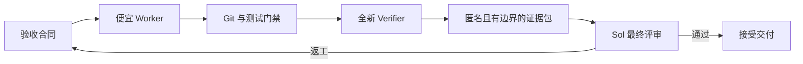

<div align="center">
  <picture>
    <source media="(prefers-color-scheme: dark)" srcset=".github/logo-dark.svg">
    <source media="(prefers-color-scheme: light)" srcset=".github/logo-light.svg">
    
  </picture>

  <p><a href="README.md">English</a> | <strong>中文</strong></p>

  <p><strong>把前沿模型的 Token 花在判断上，而不是实现上。</strong></p>
</div>

<div align="center">

[![License: MIT][license-shield]][license-url]
[![Release][release-shield]][release-url]
[![Tests][tests-shield]][tests-url]
[![Agent Skills][skills-shield]][skills-url]
[![Python][python-shield]][python-url]

</div>

<div align="center">
  <a href="#why">为什么</a> &middot;
  <a href="#evidence">实验依据</a> &middot;
  <a href="#quick-start">快速开始</a> &middot;
  <a href="#install">安装</a> &middot;
  <a href="docs/architecture.md">架构</a>
</div>

<br>

兼容 [Agent Skills](https://agentskills.io) 标准。内置 Runtime 只使用 Python 标准库；Codex CLI、Claude Code 和 MiniMax Code 都是可选的执行通道。

---

<a id="why"></a>

## 为什么需要 Token Firewall

强大的编程模型通常会按照它在浏览文件、运行测试和实现常规改动时消耗的每个 Token 计费。如果昂贵模型亲自完成整个任务，大部分预算会被花在执行过程，而不是最需要高智能的判断环节。

Token Firewall 把昂贵模型变成一个有明确边界的总评审者。系统先把任务拆解为显式合同，再把实现工作委派给更便宜的 Worker，通过 Git 和批准的测试重建证据，最后只把一份紧凑、匿名的 Review Packet 交给昂贵模型决策。

## 你将获得什么

- **把昂贵 Token 留给关键决策。** Sol/GPT-5.6 只评审紧凑的证据包，不再基于完整对话亲自实现。
- **让便宜 Worker 更可靠。** 每份 Work Order 都必须包含正例、反例和清晰的语义边界。
- **相信 Git 和测试，而不是模型的自述。** Broker 会独立检查修改范围、重建 Patch，并重新运行批准的验证命令。
- **自由选择现有的 M3 通道。** MiniMax M3 既可以通过 MiniMax Code 运行，也可以通过能够验证实际模型身份的 Claude Code 运行；两种 Harness 都不是安装依赖。
- **观察外部任务，同时避免终端刷屏。** 追加式事件、低频状态卡、Session ID、用量和交付哈希都可审计。
- **同时衡量质量和节省效果。** 冻结的配对实验会把失败尝试、返工、隐藏测试、原生用量和昂贵评审模型 Token 统一纳入 Evaluation Lab。
- **默认闭锁失败。** 模型身份未知、隔离不安全、源仓库不干净、用量不完整、Commit 不匹配或归档损坏，都会立即阻止该路线，而不是静默降低标准。

<a id="evidence"></a>

## 实验依据

> **方向性 Pilot，并非普遍性的非劣效结论。** 当前冻结数据集只有两个配对 Bug 修复任务（`n=2`）：一个低风险语义边界任务和一个高风险鉴权任务。按照发布协议，所有路线的结论仍然是 `INSUFFICIENT_SAMPLE`。

<div align="center">
  
</div>

| 路线 | 通过任务 | 对照组 Sol Token | 该路线 Sol Token | Sol Token 降幅 | 冻结结论 |
|---|---:|---:|---:|---:|---|
| M3 协作 Loop | 2/2 | 598,925 | 242,649 | 59.49% | `INSUFFICIENT_SAMPLE` |
| Terra 协作 Loop | 2/2 | 598,925 | 142,312 | 76.24% | `INSUFFICIENT_SAMPLE` |
| Claude Sonnet 协作 Loop | 0/2 | 598,925 | 0 | 无法解释 | `INSUFFICIENT_SAMPLE` |

在两个 Pilot 任务中，M3 和 Terra 路线都保留了可接受的交付质量，同时减少了 Sol Token。Claude Sonnet 没有消耗 Sol 评审 Token，是因为两个候选结果都没有进入最终评审；这属于质量失败，不能被解释为节省了 100%。

实验冻结了 Base Commit、公开验证器、延后执行的隐藏测试、匿名 Sol 评审、Session 级用量统计，以及所有失败和重试记录。发布协议要求至少完成 12 个任务对，并覆盖更广泛的任务类型，才能做出正式发布判断。

- [实验方法、局限与复现说明](docs/evaluation.md)
- [冻结的 M3 Lab](evidence/labs/m3-route-model-only-001/report/evaluation-report.md) · [Terra Lab](evidence/labs/terra-route-model-only-001/report/evaluation-report.md) · [Claude Lab](evidence/labs/claude-route-model-only-001/report/evaluation-report.md)

<a id="quick-start"></a>

## 快速开始

```text
“使用 token-firewall-team 实现这个 Issue”  —— 有边界的委派、Git/测试门禁和紧凑的最终评审
“将这条路线与 Sol 直接实现进行基准对比” —— 冻结的配对记录、Token 统计和评估图表
“显示外部 Worker 的状态”                 —— 低噪声状态、心跳、Session、用量和交付摘要
```

<a id="install"></a>

## 安装

```bash
npx skills add WdBlink/token-firewall-team -g
```

Skill 本身没有第三方 Python 依赖。你需要 Codex，以及至少一条可用的执行路线：

| 能力 | 要求 | 是否必需 |
|---|---|---:|
| Terra/Sol 路线 | Codex CLI 中可以使用所选模型 | 可选 |
| 通过 Claude Code 调用 M3 | Claude Code；返回的 `modelUsage` 必须能验证 MiniMax M3 身份 | 可选 |
| 通过 MiniMax Code 调用 M3 | MiniMax Code/Mavis CLI，且生产预检结果安全 | 可选 |
| 协议验证与 Evaluation Lab | Python 3.10+ | 必需 |

缺少 MiniMax Code 只会禁用原生 MiniMax 路线；缺少 Claude Code 只会禁用 Claude 通道。Token Firewall 绝不会在一个正在执行的 Run 中静默切换 Harness。

## 使用方法

在编程任务中要求 Codex 使用这个 Skill：

```text
使用 token-firewall-team 完成这个改动。保留 Sol 作为最终评审者，
把实现工作交给批准的便宜 Worker，并且只显示状态变化和低频心跳。
```

也可以直接调用内置 Runtime：

```bash
TF="python3 skills/token-firewall-team/scripts/token_firewall.py"

# 只检查准备使用的路线；预检不会消耗模型 Token。
$TF runtime-preflight --runtime codex
$TF runtime-preflight --runtime claude
$TF runtime-preflight --runtime minimax --agent coder

# 委派前验证不可变合同。
$TF validate mission-contract.json
$TF validate work-order.json
```

一个真实 Run 还需要：干净的 Git 仓库、完整的 Base Commit ID、位于源仓库之外的 Run 目录，以及显式指定的 Worker 路线。完整命令参见 [Runtime Runbook](skills/token-firewall-team/references/runbook.md)。

## 工作原理



系统的权威链为：不可变合同 → 确定性的 Broker/Git 门禁 → 全新 Verifier → Sol 总评审者。Worker 的输出始终只是一份候选方案。

→ [架构与传输边界](docs/architecture.md)

## 适用场景

当实现上下文很大、昂贵模型可以负责最终判断，并且任务能够通过确定性的验收证据表达时，适合使用 Token Firewall。

不要用它掩盖薄弱的验收标准，也不要在未经批准时自动执行不可逆的生产操作，更不能通过当前两个任务的 Pilot 宣称普遍性的质量结论。关键迁移、破坏性操作和无法消除的高歧义任务，仍应交给获准使用的最强实现模型，并设置明确的人工边界。

## 当前限制

- 当前实验是方向性的（`n=2`），尚未达到冻结协议要求的 12 个任务对发布门槛。
- MiniMax Code 的原生可用性和权限行为可能随应用版本变化，因此 Adapter 会默认闭锁失败。
- Claude Code 能提供结构化交付和经过验证的模型身份，但执行中途的细粒度进度仍然比最终 Stage 证据更粗。
- Claude 外层操作系统写入沙箱目前只在 macOS 上实现；其他平台必须提供等效且经过验证的边界，才能用于生产环境。
- Sol 仍然是交付是否接受的最终决策者；隐藏测试本身不等同于语义评审。

## 仓库内容

```text
skills/token-firewall-team/  完整、可安装的 Skill 包
  SKILL.md                   Agent 工作流与路由规则
  references/                协议、Runtime Runbook 与校准证据
  scripts/token_firewall.py  零第三方依赖的 CLI 入口
  scripts/token_firewall_runtime/  内置 Python Runtime 与 JSON Schemas
tests/token_firewall/        92 项协议、Runtime、故障、归档与评估测试
evidence/labs/               冻结的配对记录、哈希、报告与确定性图表
docs/                        面向使用者的架构与评估说明
```

## 参与贡献

欢迎贡献。请保持默认闭锁失败的权威链，为协议变更补充测试，并避免把模型完整记录或凭据提交到仓库。详情参见 [CONTRIBUTING.md](CONTRIBUTING.md)。

## 开源协议

[MIT](LICENSE) © 2026 WdBlink。

---

Forged with [Skill Forge](https://github.com/motiful/skill-forge) · Crafted with [Readme Craft](https://github.com/motiful/readme-craft)

[license-shield]: https://img.shields.io/github/license/WdBlink/token-firewall-team.svg?style=flat-square
[license-url]: LICENSE
[release-shield]: https://img.shields.io/github/v/release/WdBlink/token-firewall-team?style=flat-square
[release-url]: https://github.com/WdBlink/token-firewall-team/releases
[tests-shield]: https://img.shields.io/github/actions/workflow/status/WdBlink/token-firewall-team/tests.yml?branch=main&style=flat-square&label=tests
[tests-url]: https://github.com/WdBlink/token-firewall-team/actions/workflows/tests.yml
[skills-shield]: https://img.shields.io/badge/Agent%20Skills-compatible-7F56D9?style=flat-square
[skills-url]: https://agentskills.io
[python-shield]: https://img.shields.io/badge/Python-3.10%2B-3776AB?style=flat-square&logo=python&logoColor=white
[python-url]: https://www.python.org/
