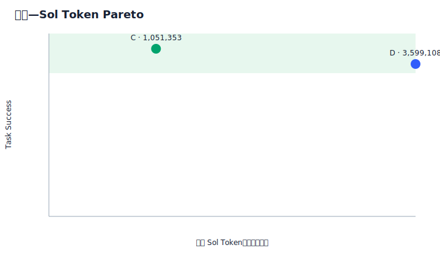
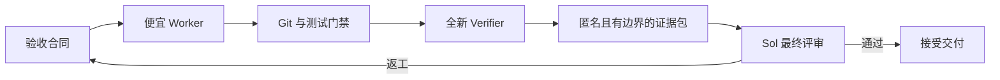

<div align="center">
  <picture>
    <source media="(prefers-color-scheme: dark)" srcset=".github/logo-dark.svg">
    <source media="(prefers-color-scheme: light)" srcset=".github/logo-light.svg">
    
  </picture>

  <p><a href="README.md">English</a> | <strong>中文</strong></p>

  <p><strong>12 组配对任务节省 70.79% 的昂贵模型 Token，同时未观察到交付质量下降。</strong></p>
  <p><sub>协同路线通过了预先冻结的 5 个百分点非劣效门槛：任务成功率 91.67%，对照组为 83.33%。</sub></p>
</div>

<div align="center">

[![License: MIT][license-shield]][license-url]
[![Release][release-shield]][release-url]
[![Tests][tests-shield]][tests-url]
[![Agent Skills][skills-shield]][skills-url]
[![Python][python-shield]][python-url]

</div>

<div align="center">
  <a href="#why">为什么</a> &middot;
  <a href="#evidence">实验依据</a> &middot;
  <a href="#evaluation-framework">评估框架</a> &middot;
  <a href="#quick-start">快速开始</a> &middot;
  <a href="#install">安装</a> &middot;
  <a href="docs/architecture.md">架构</a>
</div>

<br>

兼容 [Agent Skills](https://agentskills.io) 标准。内置 Runtime 只使用 Python 标准库；Codex CLI、Claude Code 和 MiniMax Code 都是可选的执行通道。

> **扩展实验核心结果：** 在 12 组覆盖低/中/高风险的配对任务中，Terra 实现、Sol 评审的协同路线把累计昂贵 Sol Token 从 **3,599,108** 降至 **1,051,353**，即节省 **70.79%**；任务成功率为 **91.67%**，Sol 直接实现对照组为 **83.33%**。预先冻结的配对非劣效门槛通过。
>
> **结论边界：** 本实验在冻结协议下没有观察到交付质量下降，但不能据此保证所有仓库、模型版本和任务分布都必然等价。

---

<a id="why"></a>

## 为什么需要 Token Firewall

强大的编程模型通常会按照它在浏览文件、运行测试和实现常规改动时消耗的每个 Token 计费。如果昂贵模型亲自完成整个任务，大部分预算会被花在执行过程，而不是最需要高智能的判断环节。

Token Firewall 把昂贵模型变成一个有明确边界的总评审者。系统先把任务拆解为显式合同，再把实现工作委派给更便宜的 Worker，通过 Git 和批准的测试重建证据，最后只把一份紧凑、匿名的 Review Packet 交给昂贵模型决策。

## 你将获得什么

- **把昂贵 Token 留给关键决策。** Sol/GPT-5.6 只评审紧凑的证据包，不再基于完整对话亲自实现。
- **让便宜 Worker 更可靠。** 每份 Work Order 都必须包含正例、反例和清晰的语义边界。
- **相信 Git 和测试，而不是模型的自述。** Broker 会独立检查修改范围、重建 Patch，并重新运行批准的验证命令。
- **自由选择现有的 M3 通道。** MiniMax M3 既可以通过 MiniMax Code 运行，也可以通过能够验证实际模型身份的 Claude Code 运行；两种 Harness 都不是安装依赖。
- **观察外部任务，同时避免终端刷屏。** 追加式事件、低频状态卡、Session ID、用量和交付哈希都可审计。
- **同时衡量质量和节省效果。** 冻结的配对实验会把失败尝试、返工、隐藏测试、原生用量和昂贵评审模型 Token 统一纳入 Evaluation Lab。
- **默认闭锁失败。** 模型身份未知、隔离不安全、源仓库不干净、用量不完整、Commit 不匹配或归档损坏，都会立即阻止该路线，而不是静默降低标准。

<a id="evidence"></a>

## 实验依据

主要的 Terra 扩展实验包含 12 组配对任务，覆盖 feature、bugfix、refactor、integration，以及低/中/高三个风险层级。每个实验臂都从相同的冻结 Commit 与验收合同开始。只有公开门禁、延后隐藏测试、匿名有界评审、范围检查和完整用量证据全部通过，任务才计为成功。

<div align="center">
  
</div>

| 实验 / 路线 | 配对任务 | 相对 Sol 直做的成功率 | 平均质量分 | 对照组 Sol Token | 路线 Sol Token | Sol Token 降幅 | 结论 |
|---|---:|---|---:|---:|---:|---:|---|
| **Terra 扩展实验** | **12** | **83.33% → 91.67%** | **94.58 → 96.67** | **3,599,108** | **1,051,353** | **70.79%** | **`PASS`** |
| M3 方向性 Pilot | 2 | 100% → 100% | 100 → 100 | 598,925 | 242,649 | 59.49% | `INSUFFICIENT_SAMPLE` |
| Claude Sonnet 方向性 Pilot | 2 | 100% → 0% | 100 → 7.5 | 598,925 | 0 | 无法解释 | `INSUFFICIENT_SAMPLE` |

Terra 扩展实验的配对成功率差为 **+8.33 个百分点**，配对 Bootstrap 95% 区间为 **[0, 25]** 个百分点。区间下界高于冻结的 −5 个百分点门槛，同时没有关键回退、用量完整、样本量与覆盖门槛均满足，因此协议给出 `PASS`：**本实验中 Token 显著下降，同时没有观察到交付质量损失。**

有一个候选数据集任务在两个实验臂都完成后才被排除，因为它的隐藏断言与冻结的 Acceptance Spec 矛盾；该记录和替补决策仍完整披露在实验日程中。一个真实语义失败和一次 Harness 恢复尝试仍保留在统计中。M3 与 Claude 仍只是各 2 个任务的方向性 Pilot，不能混入 12 任务 Terra 结论。

- [实验方法、局限与复现说明](docs/evaluation.md)
- [冻结的 12 任务 Terra Lab](evidence/labs/terra-route-n12-001/report/evaluation-report.md) · [可复现实验任务集](experiments/terra-route-n12-001/) · [M3 Pilot](evidence/labs/m3-route-model-only-001/report/evaluation-report.md) · [Claude Pilot](evidence/labs/claude-route-model-only-001/report/evaluation-report.md)

<a id="quick-start"></a>

## 快速开始

```text
“使用 token-firewall-team 实现这个 Issue”  —— 有边界的委派、Git/测试门禁和紧凑的最终评审
“将这条路线与 Sol 直接实现进行基准对比” —— 冻结的配对记录、Token 统计和评估图表
“显示外部 Worker 的状态”                 —— 低噪声状态、心跳、Session、用量和交付摘要
```

<a id="install"></a>

## 安装

```bash
npx skills add WdBlink/token-firewall-team -g
```

Skill 本身没有第三方 Python 依赖。你需要 Codex，以及至少一条可用的执行路线：

| 能力 | 要求 | 是否必需 |
|---|---|---:|
| Terra/Sol 路线 | Codex CLI 中可以使用所选模型 | 可选 |
| 通过 Claude Code 调用 M3 | Claude Code；返回的 `modelUsage` 必须能验证 MiniMax M3 身份 | 可选 |
| 通过 MiniMax Code 调用 M3 | MiniMax Code/Mavis CLI，且生产预检结果安全 | 可选 |
| 协议验证与 Evaluation Lab | Python 3.10+ | 必需 |

缺少 MiniMax Code 只会禁用原生 MiniMax 路线；缺少 Claude Code 只会禁用 Claude 通道。Token Firewall 绝不会在一个正在执行的 Run 中静默切换 Harness。

## 使用方法

在编程任务中要求 Codex 使用这个 Skill：

```text
使用 token-firewall-team 完成这个改动。保留 Sol 作为最终评审者，
把实现工作交给批准的便宜 Worker，并且只显示状态变化和低频心跳。
```

也可以直接调用内置 Runtime：

```bash
TF="python3 skills/token-firewall-team/scripts/token_firewall.py"

# 只检查准备使用的路线；预检不会消耗模型 Token。
$TF runtime-preflight --runtime codex
$TF runtime-preflight --runtime claude
$TF runtime-preflight --runtime minimax --agent coder

# 委派前验证不可变合同。
$TF validate mission-contract.json
$TF validate work-order.json
```

一个真实 Run 还需要：干净的 Git 仓库、完整的 Base Commit ID、位于源仓库之外的 Run 目录，以及显式指定的 Worker 路线。完整命令参见 [Runtime Runbook](skills/token-firewall-team/references/runbook.md)。

## 工作原理



系统的权威链为：不可变合同 → 确定性的 Broker/Git 门禁 → 全新 Verifier → Sol 总评审者。Worker 的输出始终只是一份候选方案。

→ [架构与传输边界](docs/architecture.md)

<a id="evaluation-framework"></a>

## 评估框架

实际落地的是此前讨论的分层方案：

1. **Token Firewall Benchmark Runtime 是真相源。** 它冻结 Git 状态、验收合同、公开与隐藏测试、盲审、模型与 Session 身份、重试、返工和原生用量。
2. **不可变 Evaluation Pair + Evaluation Lab 负责发布判断。** 它们按 Session ID 去重累计昂贵模型 Token，运行配对 Bootstrap 非劣效分析，强制检查 12 任务、风险与任务类型覆盖，并生成确定性图表。
3. **Inspect AI 是可选的分析兼容层。** `evaluation-export-inspect` 会输出带哈希的 JSONL 数据集；随附 Adapter 支持自定义多值 Scorer、按风险/任务类型分组、按 Task ID 聚类标准误、结构化 `.eval` 日志和无需再次调用模型的离线重评分。

Inspect 不替代协议内核，因为外部 Coding CLI 的交付、Git 溯源和按 Session 去重的累计成本仍由 Token Firewall 掌握。SWE-bench 可以补充外部可比性；LLM Judge 只是语义门禁之一，不能成为唯一质量依据。

→ [框架选型、判断规则与 Inspect 集成](docs/evaluation-framework.md)

## 适用场景

当实现上下文很大、昂贵模型可以负责最终判断，并且任务能够通过确定性的验收证据表达时，适合使用 Token Firewall。

不要用它掩盖薄弱的验收标准，也不要在未经批准时自动执行不可逆的生产操作，更不能把一个合成任务实验外推成普遍性的质量保证。关键迁移、破坏性操作和无法消除的高歧义任务，仍应交给获准使用的最强实现模型，并设置明确的人工边界。

## 当前限制

- 主要实验已达到冻结的 12 任务门槛，但仍只是一个合成 Python 任务集和一组 Terra/Sol 模型配置；仍需在外部真实仓库复现。
- M3 与 Claude 路线的对比仍是各 `n=2` 的方向性 Pilot。
- MiniMax Code 的原生可用性和权限行为可能随应用版本变化，因此 Adapter 会默认闭锁失败。
- Claude Code 能提供结构化交付和经过验证的模型身份，但执行中途的细粒度进度仍然比最终 Stage 证据更粗。
- Claude 外层操作系统写入沙箱目前只在 macOS 上实现；其他平台必须提供等效且经过验证的边界，才能用于生产环境。
- Sol 仍然是交付是否接受的最终决策者；隐藏测试本身不等同于语义评审。

## 仓库内容

```text
skills/token-firewall-team/  完整、可安装的 Skill 包
  SKILL.md                   Agent 工作流与路由规则
  references/                协议、Runtime Runbook 与校准证据
  scripts/token_firewall.py  零第三方依赖的 CLI 入口
  scripts/token_firewall_runtime/  内置 Python Runtime 与 JSON Schemas
tests/token_firewall/        96 项协议、Runtime、故障、归档与评估测试
evidence/labs/               冻结的配对记录、哈希、报告与确定性图表
experiments/                 可复现任务、合同、隐藏测试与运行日程
integrations/inspect_ai/     可选的 Inspect AI 分析 Adapter
docs/                        面向使用者的架构与评估说明
```

## 参与贡献

欢迎贡献。请保持默认闭锁失败的权威链，为协议变更补充测试，并避免把模型完整记录或凭据提交到仓库。详情参见 [CONTRIBUTING.md](CONTRIBUTING.md)。

## 开源协议

[MIT](LICENSE) © 2026 WdBlink。

---

Forged with [Skill Forge](https://github.com/motiful/skill-forge) · Crafted with [Readme Craft](https://github.com/motiful/readme-craft)

[license-shield]: https://img.shields.io/github/license/WdBlink/token-firewall-team.svg?style=flat-square
[license-url]: LICENSE
[release-shield]: https://img.shields.io/github/v/release/WdBlink/token-firewall-team?style=flat-square
[release-url]: https://github.com/WdBlink/token-firewall-team/releases
[tests-shield]: https://img.shields.io/github/actions/workflow/status/WdBlink/token-firewall-team/tests.yml?branch=main&style=flat-square&label=tests
[tests-url]: https://github.com/WdBlink/token-firewall-team/actions/workflows/tests.yml
[skills-shield]: https://img.shields.io/badge/Agent%20Skills-compatible-7F56D9?style=flat-square
[skills-url]: https://agentskills.io
[python-shield]: https://img.shields.io/badge/Python-3.10%2B-3776AB?style=flat-square&logo=python&logoColor=white
[python-url]: https://www.python.org/
