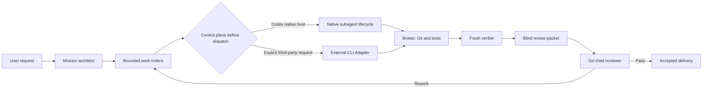

# Architecture

Token Firewall separates expensive judgment from routine implementation.

## Authority

The immutable Mission and Work Order define scope. A Worker report is only a proposal. Codex's native host may own Agent creation, messaging, status, waiting, and interruption; it never owns acceptance. The Broker reconstructs truth from the base commit, resulting patch, approved test commands, and hashed artifacts. A fresh Verifier must pass before the bounded packet reaches the Chief Reviewer.

## Runtime transports

| Transport | Worker models | Requirement | Isolation status |
|---|---|---|---|
| Codex native host | Terra, GPT-5.6, or host auto-route | Native Agent lifecycle tools | Read-only state proof or Broker-created isolated worktree |
| Codex CLI | Codex models | Standalone/benchmark compatibility only | Native workspace/read-only sandbox |
| Claude Code | Claude or explicitly mapped third-party models | Explicit user request plus verified `modelUsage` | macOS outer `sandbox-exec`; other platforms fail closed when equivalent isolation is unavailable |
| MiniMax Code | MiniMax models | Explicit user request | Enabled only when production preflight proves the current permission boundary safe |

Codex native is the default control plane. External transports are optional and require an explicit user request for the corresponding third-party platform. The selected transport is frozen before dispatch; Token Firewall never silently swaps Harnesses inside an active Run.

The Broker is a governance boundary, not a second native scheduler. Codex creates and manages its own Agents directly; the Broker freezes contracts, prepares isolation, checks Git truth, reruns validators, and packetizes evidence. Python never simulates the native route with a mailbox or nested `codex exec` process.

## Evidence chain

Each Run persists an append-only JSONL ledger, a rebuildable SQLite index, structured Stage results, normalized usage, Git diff hashes, Delivery Gate evidence, and a bounded Review Packet. Failed calls, retries, timeouts, and rework remain in evaluation accounting.
