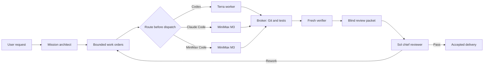

# Architecture

Token Firewall separates expensive judgment from routine implementation.

## Authority

The immutable Mission and Work Order define scope. A Worker report is only a proposal. The Broker reconstructs truth from the base commit, resulting patch, approved test commands, and hashed artifacts. A fresh Verifier must pass before the bounded packet reaches the expensive Chief Reviewer.

## Runtime transports

| Transport | Worker models | Requirement | Isolation status |
|---|---|---|---|
| Codex CLI | Terra, Sol | Codex CLI | Native workspace/read-only sandbox |
| Claude Code | M3 or Claude models | Claude Code plus verified `modelUsage` | macOS outer `sandbox-exec`; other platforms fail closed when equivalent isolation is unavailable |
| MiniMax Code | M3 | MiniMax Code/Mavis Session CLI | Enabled only when production preflight proves the current permission boundary safe |

Transports are optional. The selected transport is frozen before dispatch; Token Firewall never silently swaps Harnesses inside an active Run.

## Evidence chain

Each Run persists an append-only JSONL ledger, a rebuildable SQLite index, structured Stage results, normalized usage, Git diff hashes, Delivery Gate evidence, and a bounded Review Packet. Failed calls, retries, timeouts, and rework remain in evaluation accounting.
