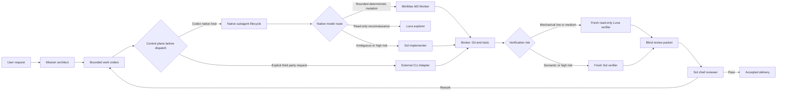

# Architecture

Token Firewall separates expensive judgment from routine implementation.

```mermaid
flowchart LR
  U[User request] --> A[Mission architect]
  A --> W[Bounded work orders]
  W --> R{Control plane before dispatch}
  R -->|Codex native host| N[Native subagent lifecycle]
  N --> M{Native model route}
  M -->|Bounded deterministic mutation| MM[MiniMax-M3 Worker]
  M -->|Read-only reconnaissance| LE[Luna explorer]
  M -->|Ambiguous or high risk| SI[Sol implementer]
  R -->|Explicit third-party request| E[External CLI Adapter]
  MM --> G[Broker: Git and tests]
  SI --> G
  E --> G
  G --> V{Verification risk}
  V -->|Mechanical low or medium| LV[Fresh read-only Luna verifier]
  V -->|Semantic or high risk| SV[Fresh Sol verifier]
  LV --> P[Blind review packet]
  SV --> P
  P --> S[Sol chief reviewer]
  S -->|Pass| D[Accepted delivery]
  S -->|Rework| W
```

## Authority

The immutable Mission and Work Order define scope. A Worker report is only a proposal. Codex's native host may own Agent creation, messaging, status, waiting, and interruption; it never owns acceptance. The Broker reconstructs truth from the base commit, resulting patch, approved test commands, and hashed artifacts. A fresh Verifier must pass before the bounded packet reaches the Chief Reviewer.

## Runtime transports

| Transport | Worker models | Requirement | Isolation status |
|---|---|---|---|
| Codex native host | MiniMax-M3 Worker, GPT-5.6 Luna explorer/verifier, GPT-5.6 Sol implementer/reviewer, explicit Terra, or host auto-route | Native Agent lifecycle tools; user-level provider config for MiniMax-M3 | Read-only state proof or Broker-created isolated worktree |
| Codex CLI | Codex models | Standalone/benchmark compatibility only | Native workspace/read-only sandbox |
| Claude Code | Claude or explicitly mapped third-party models | Explicit user request plus verified `modelUsage` | macOS outer `sandbox-exec`; other platforms fail closed when equivalent isolation is unavailable |
| MiniMax Code | MiniMax models | Explicit user request | Enabled only when production preflight proves the current permission boundary safe |

Codex native is the default control plane. A native custom agent can use the MiniMax Responses API while Codex still owns its lifecycle; model provider does not define the control plane. External transports are optional and require an explicit request for the corresponding CLI harness. The selected transport is frozen before dispatch; Token Firewall never silently swaps Harnesses inside an active Run.

The default production route has three tiers: M3 for bounded deterministic mutation, Luna for read-only reconnaissance and fresh independent verification, and Sol for ambiguous, high-risk, or final authority. Terra is reserved for explicit user selection, frozen benchmark reproduction, or a separately calibrated policy; M3 unavailability never silently selects Terra.

The Broker is a governance boundary, not a second native scheduler. Codex creates and manages its own Agents directly; the Broker freezes contracts, prepares isolation, checks Git truth, reruns validators, and packetizes evidence. Python never simulates the native route with a mailbox or nested `codex exec` process.

## Evidence chain

Each Run persists an append-only JSONL ledger, a rebuildable SQLite index, structured Stage results, normalized usage, Git diff hashes, Delivery Gate evidence, and a bounded Review Packet. Failed calls, retries, timeouts, and rework remain in evaluation accounting.
